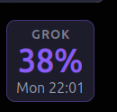
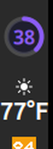

# GrokUsage

Cinnamon desklet and panel applet for Linux Mint that show SuperGrok **weekly usage**. Both use the same figure as `/usage` in the Grok TUI.

**Desktop** — used percent and reset time:



**Panel** — a circle on the task bar, same colors:




## Requirements

Install and sign in to **Grok CLI** first. These widgets do not have their own login.

```bash
grok login
```

That writes a session to `~/.grok/auth.json`. Without it, they cannot read usage.

## How it gets usage

On each refresh (every 5 minutes, or when you click the widget) it:

1. Reads the current Grok CLI session from `~/.grok/auth.json`
2. Calls the same billing endpoint the Grok TUI uses for `/usage`:
   `GET https://cli-chat-proxy.grok.com/v1/billing?format=credits`
3. Displays weekly used percent (the desklet also shows the period reset time)

No API key, cookie, or extra account setup is required beyond a normal `grok login`.

Purple is under 75% used, orange at 75%, red at 90%.

## Session lifetime

The widgets **reuse** the Grok CLI session. They do not refresh tokens on their own.

While Grok is running, the CLI keeps `auth.json` current and the widgets keep working. Access tokens last a few hours. If Grok has not been running, the session can expire and they will show **Token expired** (or `!` on the panel). Open Grok, or run `grok login` again, then click the widget to reload.

## Install

### Desklet (desktop)

Cinnamon loads desklets from `~/.local/share/cinnamon/desklets/`. The folder name must match the UUID `grok-weekly@greyster1`.

```bash
mkdir -p ~/.local/share/cinnamon/desklets
git clone https://github.com/greyster1/GrokUsage.git ~/.local/share/cinnamon/desklets/grok-weekly@greyster1
```

Then open **System Settings → Desklets → Installed** and enable **Grok Weekly**.

Desklets sit on the wallpaper, behind open windows. Use show-desktop (`Super+D`) if you cannot see it, then drag it where you want.

### Panel applet (task bar)

```bash
mkdir -p ~/.local/share/cinnamon/applets
cp -a ~/.local/share/cinnamon/desklets/grok-weekly@greyster1/applet \
      ~/.local/share/cinnamon/applets/grok-usage@greyster1
```

If you have not cloned the desklet:

```bash
git clone https://github.com/greyster1/GrokUsage.git /tmp/GrokUsage
mkdir -p ~/.local/share/cinnamon/applets
cp -a /tmp/GrokUsage/applet ~/.local/share/cinnamon/applets/grok-usage@greyster1
```

Then open **System Settings → Applets → Installed** and enable **Grok Usage**. Drag it on the panel if you want it somewhere else. Click to refresh.

## License

[GPL-3.0-or-later](LICENSE)
